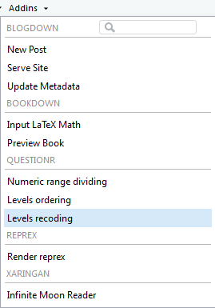
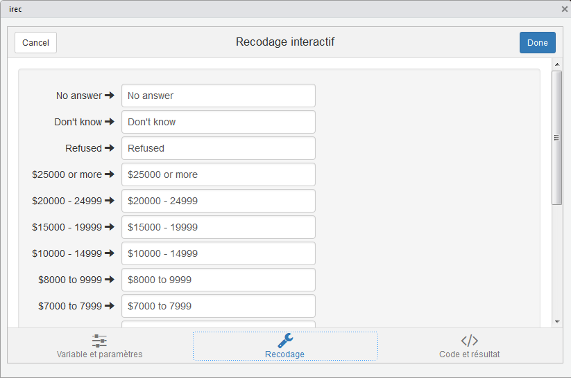

# L'extension `questionr`

L'extension `questionr` propose une interface graphique pour faciliter l'opération qui consiste à réordonner vos données.

## Mise en place

Pour installer l'extension, vous effectuez la commande suivante:

```{r eval=FALSE}
install.packages("questionr")
```

Vous pouvez ensuite la charger.

```{r message=FALSE}
library(questionr)
```

```{r echo=FALSE}
data(hdv2003)
hdv2003 <- as.tibble(hdv2003)
```

## L'interface graphique

L’objectif est de permettre à l’utilisateur de saisir les nouvelles valeurs dans un formulaire, et de générer ensuite le code `R` correspondant au recodage indiqué.

Pour utiliser cette interface, sous RStudio vous pouvez aller dans le menu _Addins_ (présent dans la barre d’outils principale) puis choisir _Levels recoding_.

```{r addin-irec, echo = FALSE, out.width = "25%", fig.cap = "Levels recoding dans le menu Addins"}

```

Si nous utilisons l'interface graphique pour la variable `rincome` de la base de données `gts_cat`, nous obtenons:

```{r irec, echo = FALSE, out.width = "100%", fig.cap = "L'interface graphique de Levels recoding"}

```

L’interface se compose de trois onglets : l’onglet _Variable et paramètres_ vous permet de sélectionner la variable à recoder, le nom de la nouvelle variable et d’autres paramètres, l’onglet _Recodages_ vous permet de saisir les nouvelles valeurs des modalités, et l’onglet _Code et résultat_ affiche le code `R` correspondant ainsi qu’un tableau permettant de vérifier les résultats.

Une fois votre recodage terminé, cliquez sur le bouton _Done_ et le code `R` sera inséré dans votre script `R` ou affiché dans la console.

> *Important*: cette interface est prévue pour ne pas modifier vos données. C’est donc à vous d’exécuter le code généré pour que le recodage soit réellement effectif.