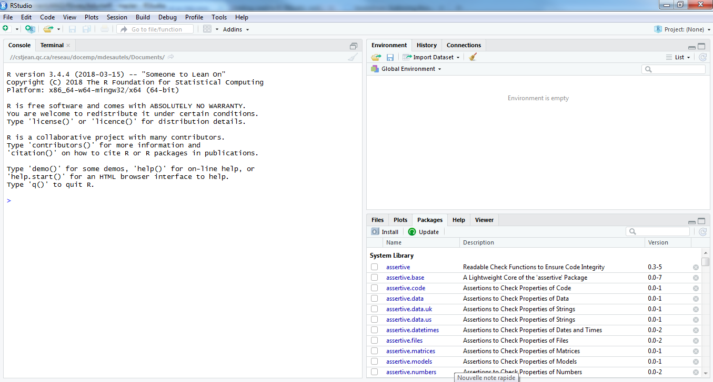
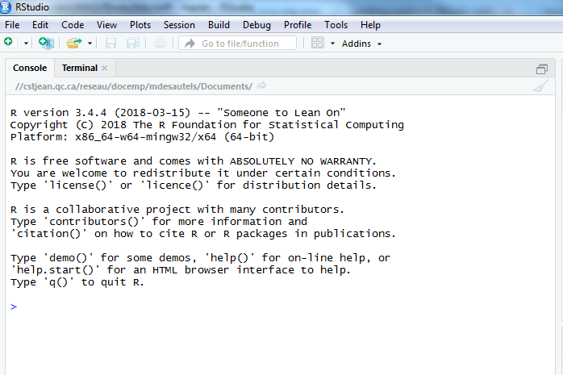

# (PART) Les outils {-}

# Les logiciels R et RStudio {#rrstudio}

Ce chapitre est inspiré de [@juba2018] et de [@ismay2018].

## Qu'est-ce que R?

R est un langage orienté vers le traitement et l'analyse quantitative de données. Il est développé depuis les années 90 par un groupe de volontaires de différents pays et par une large communauté d'utilisateurs. C'est un logiciel libre, publié sous licence GNU GPL. R a été créé par **R**oss Ihaka et **R**obert Gentleman en Nouvelle-Zélande à l'Université d'Auclkand.

Voici les avantages les plus importants de R:

1. R est un logiciel gratuit.
1. R est un logiciel très puissant, dont les fonctionnalités de base peuvent être étendues à l'aide d'extensions développées par la communauté. Il en existe plusieurs milliers.
1. R est un logiciel dont le développement est très actif et dont la communauté d'utilisateurs et l'usage ne cessent de s'agrandir.
1. Il est possible de trouver des réponses à ses questions assez facilement grâce à l'aide incluse, à la communauté, à Google, etc. Bien que l'aide soit en anglais, il existe des communautés francophones qui utilisent le  logiciel.
1. R n'est pas un logiciel au sens classique du terme, mais plutôt un langage de programmation. Il fonctionne à l'aide de scripts (des petits programmes) édités et exécutés au fur et à mesure de l'analyse. Ce point, qui peut apparaître comme un gros handicap, s'avère après un temps d'apprentissage être un mode d'utilisation d'une grande souplesse.

L'aspect langage de programmation et la difficulté qui en découle peuvent sembler des inconvénients importants. Le fait de structurer ses analyses sous forme de scripts (suite d'instructions effectuant les différentes opérations d'une analyse) présente cependant de nombreux avantages :

- le script garde par ordre chronologique l'ensemble des étapes d'une analyse, de l'importation des données à leur analyse en passant par les manipulations et les recodages
- on peut à tout moment revenir en arrière et modifier ce qui a été fait
- il est très rapide de réexécuter une suite d'opérations complexes
- on peut très facilement mettre à jour les résultats en cas de modification des données sources
- le script garantit, sous certaines conditions, la reproductibilité des résultats obtenus

Pour télécharger le logiciel R, vous allez à l'adresse suivante:

[https://www.r-project.org/](https://www.r-project.org/)

## Qu'est-ce que RStudio?

RStudio n'est pas à proprement parler une interface graphique pour `R`, il s'agit plutôt d'un *environnement de développement intégré* (*integrated development environment* en anglais), qui propose des outils et facilite l'écriture de scripts et l'usage de R au quotidien. C'est une interface bien supérieure à celles fournies par défaut lorsqu'on installe R sous Windows ou sous Mac.

Il existe plusieurs versions de RStudio:

- RStudio Desktop
- RStudio Server
- RStudio Cloud

Pour télécharger la version *Desktop* de RStudio (que vous pouvez utilisez sur votre ordinateur), vous allez à l'adresse suivante:

[https://www.rstudio.com/products/rstudio/download/#download](https://www.rstudio.com/products/rstudio/download/#download)

## Les bases de RStudio

### La console

Au premier lancement de RStudio, l'écran est séparé en trois grandes zones:

```{r console-rstudio, echo = FALSE, out.width = "100%", fig.cap = "L'interface de RStudio"}

```

La zone de gauche se nomme _Console_. À son démarrage, RStudio a lancé une nouvelle session de R et c’est dans cette fenêtre que nous allons pouvoir interagir avec lui.

Vous devriez voir un texte ressemblant à celui-ci:

```
R version 3.4.4 (2018-03-15) -- "Someone to Lean On"
Copyright (C) 2018 The R Foundation for Statistical Computing
Platform: x86_64-w64-mingw32/x64 (64-bit)

R is free software and comes with ABSOLUTELY NO WARRANTY.
You are welcome to redistribute it under certain conditions.
Type 'license()' or 'licence()' for distribution details.

R is a collaborative project with many contributors.
Type 'contributors()' for more information and
'citation()' on how to cite R or R packages in publications.

Type 'demo()' for some demos, 'help()' for on-line help, or
'help.start()' for an HTML browser interface to help.
Type 'q()' to quit R.
```

La console ressmble à ceci:

```{r console-r, echo = FALSE, out.width = "50%", fig.cap = "La console R"}

```

La ligne qui débute avec le symbole `>` est appelée l’invite de commande (ou prompt en anglais). Elle signifie que R est disponible et en attente de votre prochaine commande. C'est à cet endroit que nous pouvons entrer des commandes et les éxécuter en appuyabt sur `Entrée`.

### Environment/History/Connections

TODO

### Files/Plots/Packages/Help/Viewer

TODO