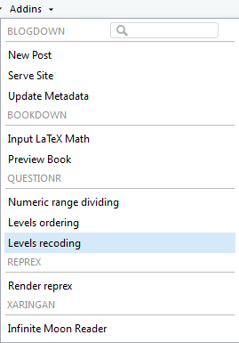

```{r include=FALSE, cache=FALSE}
## Copied from Hadley Wickham and Garrett Grolemund and Hadley Wickham's r4ds
set.seed(1978)
options(digits = 3)

knitr::opts_chunk$set(
  comment = "##",
  collapse = TRUE,
  cache = FALSE,
  out.width = "70%",
  fig.align = 'center',
  fig.width = 6,
  fig.height = 3.708,  # width * 1 / phi
  fig.show = "hold"
)

options(dplyr.print_min = 6, dplyr.print_max = 6)
```

# Introduction {-}

```{r include=FALSE}
# automatically create a bib database for R packages
knitr::write_bib(c(
  .packages(), 'bookdown', 'knitr', 'rmarkdown', 'tidyverse', 'questionr', 'nycflights13', 'forcats'
), 'packages.bib')
```

Nous sommes constamment bombardés d’information. Que ce soit sur Internet, à la télévision ou à la radio, les résultats de sondage abondent. Comment faire pour déterminer quelle information est fiable? 

Ce cours vise à faire de vous des citoyens critiques, capables d’analyser des données et d’en tirer des conclusions. 

<!--chapter:end:index.Rmd-->

```{r include=FALSE, cache=FALSE}
## Copied from Hadley Wickham and Garrett Grolemund and Hadley Wickham's r4ds
set.seed(1978)
options(digits = 3)

knitr::opts_chunk$set(
  comment = "##",
  collapse = TRUE,
  cache = FALSE,
  out.width = "70%",
  fig.align = 'center',
  fig.width = 6,
  fig.height = 3.708,  # width * 1 / phi
  fig.show = "hold"
)

options(dplyr.print_min = 6, dplyr.print_max = 6)
```
# (PART) Les outils {-}

# Les logiciels R et RStudio {#rrstudio}

Ce chapitre est inspiré de [@juba2018] et de [@ismay2018].

## Qu'est-ce que R?

R est un langage orienté vers le traitement et l'analyse quantitative de données. Il est développé depuis les années 90 par un groupe de volontaires de différents pays et par une large communauté d'utilisateurs. C'est un logiciel libre, publié sous licence GNU GPL. R a été créé par **R**oss Ihaka et **R**obert Gentleman en Nouvelle-Zélande à l'Université d'Auclkand.

Voici les avantages les plus importants de R:

1. R est un logiciel gratuit.
1. R est un logiciel très puissant, dont les fonctionnalités de base peuvent être étendues à l'aide d'extensions développées par la communauté. Il en existe plusieurs milliers.
1. R est un logiciel dont le développement est très actif et dont la communauté d'utilisateurs et l'usage ne cessent de s'agrandir.
1. Il est possible de trouver des réponses à ses questions assez facilement grâce à l'aide incluse, à la communauté, à Google, etc. Bien que l'aide soit en anglais, il existe des communautés francophones qui utilisent le  logiciel.
1. R n'est pas un logiciel au sens classique du terme, mais plutôt un langage de programmation. Il fonctionne à l'aide de scripts (des petits programmes) édités et exécutés au fur et à mesure de l'analyse. Ce point, qui peut apparaître comme un gros handicap, s'avère après un temps d'apprentissage être un mode d'utilisation d'une grande souplesse.

L'aspect langage de programmation et la difficulté qui en découle peuvent sembler des inconvénients importants. Le fait de structurer ses analyses sous forme de scripts (suite d'instructions effectuant les différentes opérations d'une analyse) présente cependant de nombreux avantages :

- le script garde par ordre chronologique l'ensemble des étapes d'une analyse, de l'importation des données à leur analyse en passant par les manipulations et les recodages
- on peut à tout moment revenir en arrière et modifier ce qui a été fait
- il est très rapide de réexécuter une suite d'opérations complexes
- on peut très facilement mettre à jour les résultats en cas de modification des données sources
- le script garantit, sous certaines conditions, la reproductibilité des résultats obtenus

Pour télécharger le logiciel R, vous allez à l'adresse suivante:

[https://www.r-project.org/](https://www.r-project.org/)

## Qu'est-ce que RStudio?

RStudio n'est pas à proprement parler une interface graphique pour `R`, il s'agit plutôt d'un *environnement de développement intégré* (*integrated development environment* en anglais), qui propose des outils et facilite l'écriture de scripts et l'usage de R au quotidien. C'est une interface bien supérieure à celles fournies par défaut lorsqu'on installe R sous Windows ou sous Mac.

Il existe plusieurs versions de RStudio:

- RStudio Desktop
- RStudio Server
- RStudio Cloud

Pour télécharger la version *Desktop* de RStudio (que vous pouvez utilisez sur votre ordinateur), vous allez à l'adresse suivante:

[https://www.rstudio.com/products/rstudio/download/#download](https://www.rstudio.com/products/rstudio/download/#download)

## Les bases de RStudio


<!--chapter:end:chapitres/rrstudio.Rmd-->

```{r include=FALSE, cache=FALSE}
## Copied from Hadley Wickham and Garrett Grolemund and Hadley Wickham's r4ds
set.seed(1978)
options(digits = 3)

knitr::opts_chunk$set(
  comment = "##",
  collapse = TRUE,
  cache = FALSE,
  out.width = "70%",
  fig.align = 'center',
  fig.width = 6,
  fig.height = 3.708,  # width * 1 / phi
  fig.show = "hold"
)

options(dplyr.print_min = 6, dplyr.print_max = 6)
```
# Le tidyverse {#tidyverse}

Dans ce document, nous utiliserons l'extension  `tidyverse` par [@R-tidyverse]. Ce chapitre permettra d'introduire l'extension `tidyverse` mais surtout les principes qui la sous-tendent. Ce chapitre est inspiré de [@juba2018] et [@wickham2017].

```{r message=FALSE}
library(tidyverse)
library(questionr)
```

## Extensions

Le terme *tidyverse* est une contraction de *tidy* (qu'on pourrait traduire par *bien rangé*) et de *universe*. En allant visiter le site internet de ces extensions [https://www.tidyverse.org/](https://www.tidyverse.org/), voici ce que nous pouvons trouver sur la première page du site:

> The tidyverse is an opinionated collection of R packages designed for data science. All packages share an underlying design philosophy, grammar, and data structures. 

que nous pourrions traduire par:

> Le tidyverse est une collection dogmatique d'extensions pour le langage R conçues pour la science des données. Toutes les extensions partagent une philosphie sous-jacente de design, de grammaire et de structures de données.

Ces extensions abordent un très grand nombre d'opérations courantes dans `R`. L'avantage d'utiliser le `tidyverse` c'est qu'il permet de simplifier plusieurs opérations fréquentes et il introduit le concept de **tidy data**. De plus, la grammaire du `tidyverse` étant cohérente entre toutes ses extensions, en apprenant comment utiliser l'une de ces extensions, vous serez en monde connu lorsque viendra le temps d'apprendre de nouvelles extensions.

Nous utiliserons le `tidyverse` pour:

- Le concept de **tidy data**
- L'importation et/ou l'exportation de données
- La manipulation de variables
- La visualisation

Le `tidyverse` permet aussi de:

- Travailler avec des chaînes de caractères (du texte par exemple)
- Programmer
- Remettre en forme des données
- Extraire des données du Web
- Etc.

Pour en savoir plus, nous invitons le lecteur à se rendre au site du `tidyverse` [https://www.tidyverse.org/](https://www.tidyverse.org/). Le `tidyverse` est en grande partie issu des travaux de [Hadley Wickham](http://hadley.nz/).

## Installation

Pour installer les extensions du `tidyverse`, nous effectuons la commande suivante:

```{r eval=FALSE}
install.packages("tidyverse")
```

Une fois l'extension installée, il n'est pas nécessaire de la réinstaller à chaque fois que vous utilisez `R`. Par contre, vous devez charger l'extension à chaque fois que vous utilisez `R`.

Pour charger l'extension et l'utiliser dans `R`, nous effectuons la commande suivante:

```{r eval=FALSE}
library(tidyverse)
```

Cette commande va en fait charger plusieurs extensions qui constituent le __coeur__ du `tidyverse`, à savoir :

- `ggplot2` (visualisation)
- `dplyr` (manipulation des données)
- `tidyr` (remise en forme des données)
- `purrr` (programmation)
- `readr` (importation de données)
- `tibble` (tableaux de données)
- `forcats` (variables qualitatives)
- `stringr` (chaînes de caractères)

Il existe d'autres extensions qui font partie du `tidyverse` mais qui doivent être chargées explicitement, comme par exemple `readxl` (pour l'importation de données depuis des fichiers Excel).

La liste complète des extensions se trouve sur le site officiel du `tidyverse` [https://www.tidyverse.org/packages/](https://www.tidyverse.org/packages/).

## Les tidy data {#tidydata}

Le `tidyverse` est en partie fondé sur le concept de *tidy data*, développé à l'origine par Hadley Wickham dans un article du *Journal of Statistical Software*, voir [@wickham2014]. Nous pourrions traduire ce concept par *données bien rangées*.

Il s'agit d'un modèle d'organisation des données qui vise à faciliter le travail souvent long et fastidieux de nettoyage et de préparation préalable à la mise en oeuvre de méthodes d'analyse. Dans ce livre, nous travaillerons toujours avec des *tidy data*. En réalité, la plupart des données rencontrées par les chercheurs ne sont pas *tidy*. Il existe une extension du `tidyverse` qui permet de faciliter la transformation de données *non tidy* en données *tidy*, l'extension `tidyr`. Nous ne verrons pas comment l'utiliser dans ce livre.

Les principes d'un jeu de données *tidy* sont les suivants :

1. chaque variable est une colonne
2. chaque observation est une ligne
3. chaque valeur doit être dans une cellule différente

La figure \@ref(fig:tidy-structure) montre ces règles de façon visuelle (l'image a été prise de [@wickham2017]).

```{r tidy-structure, echo = FALSE, out.width = "100%", fig.cap = "Suivre les trois principes rend les données tidy: les variables sont en colonnes, les observations sont sur des lignes, et chaques valeurs sont dans des cellules différentes."}
knitr::include_graphics("images/tidy-1.png")
```

Pourquoi s'assurer que vos données sont *tidy*? Il y a deux avantages importants:

1. Un avantage général de choisir une seule façon de conserver vos données.
   Si vous utilisez une structure de données consitante, il est plus facile
   d'apprendre à utiliser les outils qui fonctionneront avec ce type de 
   structure, étant donné que celles-ci possède une uniformité sous-jacente.
   
1. Un avantage spécifique de placer les variables en colonnes car ceci permet 
   de *vectoriser* les opérations dans `R`. Ceci implique que vos fonctions seront plus
   rapides lorsque viendra le temps de les exécuter.
   
Voici un exemple de données *tidy* qui sont accessibles en `R` de base.

```{r as-tibble-mtcars}
as_tibble(rownames_to_column(mtcars))
```

## Les tibbles {#tibbles}

Une autre particularité du *tidyverse* est que ces extensions travaillent avec des tableaux de données au format *tibble*, qui est une évolution plus moderne du classique *data frame* du R de base. Ce format est fourni est géré par l'extension du même nom (`tibble`), qui fait partie du coeur du *tidyverse*. La plupart des fonctions des extensions du *tidyverse* acceptent des *data frames* en entrée, mais retournent un objet de classe `tibble`.

Pour être en mesure d'effectuer des  calculs statistiques, il nous faut une structure qui soit en mesure de garder en mémoire une base de données. Ces structures se nomment des "tibbles" dans R.

### Prérequis

Pour être en mesure d'utiliser le paquetage **tibble**, nous devons charger l'extension **tibble**. Pour ce faire, il suffit d'utiliser la commande suivante:

```{r}
library(tibble)
```

### Un exemple de **tibble**

Pour comprendre ce qu'est un **tibble**, nous allons utiliser deux librairies: `nycflights13` et `diamonds`. Si ce n'est pas déjà fait, vous devez les installer et ensuite les charger.

```{r}
library(nycflights13)
library(ggplot2)
```

Nous allons étudier le paquetage `nycflights13`qui contient 5 bases de données contenant des informations concernant les vols intérieurs en partance de New York en 2013, à partir des aéroports de Newark Liberty International (EWR), John F. Kennedy International (JFK) ou LaGuardia (LGA). Les 5 bases de données sont les suivantes:

- flights: information sur les 336,776 vols
- airlines: lien entre les codes IATA de deux lettres et les noms de compagnies d'aviation (16 au total)
- planes: information de construction sur les 3 322 avions utilisés
- weather: données météo à chaque heure (environ 8 710 observations) pour chacun des trois aéroports.
- airports: noms des aéroports et localisations

### La base de données flights

Pour visualiser facilement une base de données sous forme **tibble**, il suffit de taper son nom dans la console. Nous allons utiliser la base de données flights. Par exemple:

```{r}
flights
```

Nous allons décortiquer la sortie console:

- `A tibble: 336,776 x 19`: un **tibble** est une façon de représenter une base de données en R. Cette base de données possède:
    * `336 776` lignes
    * `19` colonnes correspondant aux 19 variables décrivant chacune des observations
- `year month` `day` `dep_time` `sched_dep_time` `dep_delay` `arr_time` sont différentes colonnes, en d'autres mots des variables, de cette base de données.
- Nous avons ensuite 10 lignes d'obervations correspondant à 10 vols
- `... with 336,766 more rows, and 12 more variables:` nous indique que 336 766 lignes et 12 autres variables ne pouvaient pas être affichées à l'écran.

Malheureusement cette sortie écran ne nous permet pas d'explorer les données correctement. Nous verrons à la section \@ref(explorertibbles) comment explorer des **tibbles**.

### La base de données **diamonds** {#donneesdiamonds}

La base de données **diamonds** est composée des variables suivantes:

- `price` : prix en dollars US
- `carat` : poids du diamant en grammes
- `cut` : qualité de la coupe (Fair, Good, Very Good, Premium, Ideal)
- `color` : couleur du diamant (J (pire) jusqu'à D (meilleur))
- `clarity` : une mesure de la clarté du diamant (I1 (pire), SI2, SI1, VS2, VS1, VVS2, VVS1, IF (meilleur))
- `x` : longueur en mm
- `y` : largeur en mm
- `z` : hauteur en mm
- `depth` : z / mean(x, y) = 2 * z / (x + y)
- `table` : largeur du dessus du diamant par  rapport à son point le plus large

```{r}
diamonds
```

### Comment explorer des "tibbles" {#explorertibbles}

Voici les façons les plus communes de comprendre les données se trouvant à l'intérieur d'un "tibble":

    1. En utilisant la fonction `View()` de RStudio.C'est la commande que nous utiliserons le plus fr?quemment.
    2. En utilisant la fonction `glimpse()` du paquetage knitr
    3. En utilisant la fonction `kable()`
    4. En utilisant l'opérateur `$` pour étudier une seule variable d'une base de données

1. `View()`:

Éxécutez `View(flights)` dans la console de RStudio et explorez la base de données obtenue. 

Nous remarquons que chaque colonnes représentent une variable différente et que ces variables peuvent être de différents types. Certaines de ces variables, comme `distance`, `day` et `arr_delay` sont des variables dites quantitatives. Ces variables sont numériques par nature. D'autres variables sont dites qualitatives.

Si vous regardez la colonne à l'extrème-gauche de la sortie de `View(flights)`, vous verrez une colonne de nombres. Ces nombres représentent les numéros de ligne de la base de données. Si vous vous promenez sur une ligne de même nombre, par exemple la ligne 5, vous étudiez une unité statistique.

2. `glimpse`:

La seconde façon d'explorer une base de données est d'utiliser la fonction `glimpse()`. Cette fonction nous donne la majorité de l'information précédente et encore plus.

```{r}
glimpse(flights)
```

3. `kable()`:

La dernière façon d'étudier l'entièreté de la base de données est d'utiliser la fonction `kable()` de la librairie `knitr`. Nous allons explorer les codes des différentes compagnies d'aviation de deux façons.

```{r}
library(knitr)
airlines
kable(airlines)
```

À première vue, les deux sorties sont semblables sauf que la seconde est beaucoup plus agréable visuellement dans un document R Markdown.

4. L'opérateur `$`:

Finalement, l'opérateur `$` nous permet d'explorer une seule variable à l'intérieur d'une base de données. Par exemple, si nous désirons étudier la variable `name` de la base de données `airlines`, nous obtenons:

```{r}
airlines$name
```

<!--chapter:end:chapitres/tidyverse.Rmd-->

```{r include=FALSE, cache=FALSE}
## Copied from Hadley Wickham and Garrett Grolemund and Hadley Wickham's r4ds
set.seed(1978)
options(digits = 3)

knitr::opts_chunk$set(
  comment = "##",
  collapse = TRUE,
  cache = FALSE,
  out.width = "70%",
  fig.align = 'center',
  fig.width = 6,
  fig.height = 3.708,  # width * 1 / phi
  fig.show = "hold"
)

options(dplyr.print_min = 6, dplyr.print_max = 6)
```
# L'extension `questionr`

L'extension `questionr` propose une interface graphique pour faciliter l'opération qui consiste à réordonner vos données.

## Mise en place

Pour installer l'extension, vous effectuez la commande suivante:

```{r eval=FALSE}
install.packages("questionr")
```

Vous pouvez ensuite la charger.

```{r message=FALSE}
library(questionr)
```

```{r echo=FALSE}
data(hdv2003)
hdv2003 <- as.tibble(hdv2003)
```

## L'interface graphique

L’objectif est de permettre à l’utilisateur de saisir les nouvelles valeurs dans un formulaire, et de générer ensuite le code `R` correspondant au recodage indiqué.

Pour utiliser cette interface, sous RStudio vous pouvez aller dans le menu _Addins_ (présent dans la barre d’outils principale) puis choisir _Levels recoding_.

```{r addin-irec, echo = FALSE, out.width = "25%", fig.cap = "Levels recoding dans le menu Addins"}

```

Si nous utilisons l'interface graphique pour la variable `rincome` de la base de données `gts_cat`, nous obtenons:

```{r irec, echo = FALSE, out.width = "100%", fig.cap = "L'interface graphique de Levels recoding"}
knitr::include_graphics("images/irec.png")
```

L’interface se compose de trois onglets : l’onglet _Variable et paramètres_ vous permet de sélectionner la variable à recoder, le nom de la nouvelle variable et d’autres paramètres, l’onglet _Recodages_ vous permet de saisir les nouvelles valeurs des modalités, et l’onglet _Code et résultat_ affiche le code `R` correspondant ainsi qu’un tableau permettant de vérifier les résultats.

Une fois votre recodage terminé, cliquez sur le bouton _Done_ et le code `R` sera inséré dans votre script `R` ou affiché dans la console.

> *Important*: cette interface est prévue pour ne pas modifier vos données. C’est donc à vous d’exécuter le code généré pour que le recodage soit réellement effectif.

<!--chapter:end:chapitres/questionr.Rmd-->

```{r include=FALSE, cache=FALSE}
## Copied from Hadley Wickham and Garrett Grolemund and Hadley Wickham's r4ds
set.seed(1978)
options(digits = 3)

knitr::opts_chunk$set(
  comment = "##",
  collapse = TRUE,
  cache = FALSE,
  out.width = "70%",
  fig.align = 'center',
  fig.width = 6,
  fig.height = 3.708,  # width * 1 / phi
  fig.show = "hold"
)

options(dplyr.print_min = 6, dplyr.print_max = 6)
```
# (PART) Introduction {-}

# La démarche scientifique {#demarchescientifique}

La démarche scientifique permet d’étudier une problématique de sorte que les résultats obtenus soient valides et reproductibles. 

La démarche scientifique se divise en quatre étapes :

1. Formulation d’un sujet de recherche et méthodologie 
	 - Recherche documentaire
	 - Formulation d’hypothèses
	 - Détermination de la population et/ou de l’échantillon 
1. Collecte des données
1. Traitement des données et analyse des résultats
	 - Présentation des données
	 - Calculs de mesures
	 - Inférence statistique
1. Diffusion des résultats

Le cours de méthodes quantitatives porte entre autres sur les trois premières étapes.

Une fois le sujet de recherche choisi, il faut décider comment la recherche sera menée, c’est-à-dire établir la méthodologie. Pour ce faire, il faut d’abord déterminer s’il est préférable d’effectuer un **recensement** (étude portant sur l’ensemble de la population) ou un **sondage** (étude portant sur une partie de la population).

Il existe des avantages et des inconvénients à faire un recensement.

|:--------------|:------------------------------------------------------------------------------------------------------------------------|
| Avantages     | Les résultats obtenus correspondent exactement à la réalité. Il est aisé d’analyser des sous-ensembles de la population.|
| Inconvénients | Les coûts sont élevés.Les résultats sont longs à obtenir.|

Puisqu’il est généralement souhaitable que la récolte d’information soit faite à coûts moindres et le plus rapidement possible, le sondage est souvent utilisé. Ensuite, le chercheur doit définir les éléments suivants : 

|:--------------|:------------------------------------------------------------------------------------------|
| La population |	Ensemble des personnes, faits ou objets sur lesquels porte l’étude.Sa taille est notée $N$|
| L’unité statistique |	Une personne, fait ou objet de la population.|
| L’échantillon	|	Sous-ensemble de la population utilisé lors d’un sondage. Sa taille est notée $n$.|


Dans le choix de la méthodologie, il est aussi important de déterminer les variables étudiées, le type des variables, les échelles de mesure, les types de questions et les techniques d’échantillonnage. Ceux-ci seront étudiés dans les chapitres suivants.

<!--chapter:end:chapitres/demarche-scientifique.Rmd-->

```{r include=FALSE, cache=FALSE}
## Copied from Hadley Wickham and Garrett Grolemund and Hadley Wickham's r4ds
set.seed(1978)
options(digits = 3)

knitr::opts_chunk$set(
  comment = "##",
  collapse = TRUE,
  cache = FALSE,
  out.width = "70%",
  fig.align = 'center',
  fig.width = 6,
  fig.height = 3.708,  # width * 1 / phi
  fig.show = "hold"
)

options(dplyr.print_min = 6, dplyr.print_max = 6)
```
# Les différents types de variables {#typesvariables}

## Introduction

Chacune des notions étudiées par le chercheur porte le nom de variable. C’est logique, puisque les données recueillies vont varier d’une unité statistique à une autre. On distingue quatre types de variables séparées en deux grandes catégories : les variables qualitatives et les variables quantitatives.

### Mise en place

Dans ce chapitre, nous introduirons les différents types de variables et les façons avec lesquelles nous pouvons les utiliser en langage `R`. Nous utiliserons la librairie `tidyverse` et en particulier l'extension `forcats` pour travailler avec des variables qualitatives. Puisque l'extension `forcats` fait partie du `tidyverse` de base, nous avons simplement à charger `tidyverse`.

```{r message=FALSE}
library(tidyverse)
```

## Les variables qualitatives {#varqual}

Une variable qualitative est une variable dont les résultats possibles sont des **mots**. Les différents **mots** que peuvent prendre une telle variable sont appelées des **modalités**. Il existe deux types de variables qualitatives.

### Les variables qualitatives à échelle nominale {#qualinominale}

On observe ce type de variable lorsqu’il n’y a pas d’ordre croissant naturel dans les **modalités** de la variable. Par exemple, la variable _couleur des cheveux_ est à échelle nominale. L'ordre "blonds, bruns, roux, noirs, autre" est un ordre aussi valable que 
"bruns, noirs, roux, blonds, autre".

Imaginons que vous vouliez créer une variable qui indique le mois de l'année:

```{r}
x1 <- c("Déc", "Avr", "Jan", "Mar")
```

L'approche précédente pose deux problèmes:

1. Il n'y a que douze mois possibles et rien ne vous empêche de vous tromper dans votre entrée de modalités:

   ```{r}
   x2 <- c("Déc", "Avr", "Jam", "Mar")
   ```
   
1. Les modalités ne seront pas affichées dans un ordre logique

   ```{r}
   # La commande "sort" permet de trier les données
   sort(x1)
   ```
   
Nous pouvons résoudre ce problèmes en utilisant un **facteur** (**factor** en `R`). Pour créer un facteur, vous devez créer en premier lieu une liste avec __toutes les modalités possibles placées dans l'ordre qui vous convient__ (**levels** en `R`):

```{r}
niveaux_mois <- c(
  "Jan", "Fév", "Mar", "Avr", "Mai", "Jun",
  "Jui", "Aoû", "Sep", "Oct", "Nov", "Déc"
)
```

Vous pouvez maintenant créer un facteur:

```{r}
y1 <- factor(x1, levels = niveaux_mois)
y1
sort(y1)
```

Si certaines modalités ne sont pas dans votre liste de levels, elles seront converties en NA:

```{r}
y2 <- factor(x2, levels = niveaux_mois)
y2
```

Si vous n'utilisez pas vos levels, vos modalités seront affichées en ordre alphabétique:

```{r}
factor(x1)
```

Le fait qu'il y ait un __ordre__ dans les modalités n'est pas suffisant pour dire qu’une variable qualitative n'est pas nominale. Dans l'exemple précédent, bien que les mois de l'année soient toujours énumérés dans un certain ordre, il serait faux de dire que Janvier < Février par exemple.

Nous pourrions créer une variable qui contient la couleur des cheveux sans indiquer de levels. De cette façon, les données seront triées en ordre alphabétique:

```{r}
x3  <- c("blonds", "bruns", "roux", "noirs", "autre")
sort(x3)
```

Nous allons maintenant utiliser de vraies données provenant du [General Social Survey](http://gss.norc.org), qui est un sondage produit par une organisation de recherche indépendante NORC à l'Université de Chicago. Le sondage original comporte des milliers de questions, la base de donnéee `forcats::gss_cat` n'en contient que quelques unes. Pour en savoir plus sur la base de données `gss_cat`, consultez @R-forcats.

```{r}
gss_cat
```

Pour visualiser les levels d'une variable facilement, nous pouvons utiliser la fonction `levels` qui retourne tous les levels différents rencontrés pour cette variable. Voici par exemple les levels pour les variables `race` et `marital`

```{r}
levels(gss_cat$race)
levels(gss_cat$marital)
```

### Les variables qualitatives à échelle ordinale {#qualord}

On observe ce type de variable lorsqu’il existe un ordre croissant dans les modalités de la variable. Par exemple, la variable _degré de satisfaction_ est à échelle ordinale. Il est possible de classer les modalités en ordre décroissant en écrivant : Très satisfait  >  Satisfait  >  Insatisfait  >  Très insatisfait.

Pour créer une variable qualitative à échelle ordinale en `R`, nous pouvons utiliser la même technique vue à la section \@ref(qualinominale). Nous pouvons donc avoir:

```{r}
z <- c("Satisfait", "Très insatisfait", "Insatisfait", "Très insatisfait", "Insatisfait")
niveaux_satisfaction <- c("Très insatisfait", "Insatisfait", "Satisfait", "Très satisfait")
z1 <- factor(z, levels = niveaux_satisfaction)
sort(z1)
```

Il est aussi possible d'utiliser des **facteurs ordonnés**. Nous devons utiliser encore la commande `factor` en ajoutant l'option `ordered=TRUE`. Par example:

```{r}
z2 <- factor(z, levels = niveaux_satisfaction, ordered = TRUE)
sort(z2)
```

Remarquons que dans la liste __Levels__, `R` ajoute les symboles `<` pour indiquer que la variable possède un ordre. Il n'est pas nécessaire de travailler avec des facteurs ordonnés.

Nous remarquons que dans la base de données `forcats::gss_cat`, la variable `rincome` représente une variable qualitative à échelle ordinale:

```{r}
levels(gss_cat$rincome)
```

Si nous laissons de côté les modalités _No answer_, _Don't know_ et _Refused_, le reste des modalités peut être placé en ordre. En effet, la modalité _$4000 to 4999_ est plus petite que la modalité _$5000 to 5999_ et ainsi de suite. 

> Bien que les modalités de la variable précédente soient composées de nombres, le fait que nous ayons affaire à des intervalles indique que nous avons en fait une variable qualitative à échelle ordinale.

Les modalités sont placées en ordre décroissant, si nous voulions avoir les modalités en ordre croissant, nous pourrions faire ceci:

```{r}
a <- factor(gss_cat$rincome, 
            levels=c("Lt $1000", "$1000 to 2999", "$3000 to 3999", "$4000 to 4999", 
                     "$5000 to 5999", "$6000 to 6999", "$7000 to 7999", "$8000 to 9999", 
                     "$10000 - 14999", "$15000 - 19999", "$20000 - 24999", "$25000 or more", 
                     "No answer", "Refused", "Not applicable", "Don't know"))
levels(a)
```

## Les variables quantitatives {#quant}

Une variable quantitative est une variable dont les résultats possibles sont des **nombres**. Les différents nombres que peuvent prendre une telle variable sont appelées des **valeurs**.

### Mise en place

Dans cette section, nous utiliserons la librairie `nycflights13` (voir @R-nycflights13) qui contient cinq bases de données portant sur tous les vols aériens ayant quittés la ville de New-York en 2013.

```{r}
library(nycflights13)
```

Les cinq base de données sont les suivantes:

- `airlines`
- `airports`
- `flights`
- `planes`
- `weather`

Pour en savoir plus sur une base de données particulière, par exemple `airlines` vous pouvez utilisez la commande `?airlines`.

### Les variables quantitatives discrètes

On observe ce type de variable lorsque les valeurs sont énumérables, c’est-à-dire lorsqu’il n’existe pas de valeur possible entre deux valeurs consécutives. Par exemple, la variable _nombre de cours suivis pendant cette session_ est une variable quantitative discrète. Les valeurs de ces variables peuvent être : 3, 4, 5, 6, 7,... Il est impossible de suivre 4,6 cours durant une session.

La base de données `planes` contient certaines variables quantitatives discrètes.

```{r}
planes
```

Pour être en mesure de connaître toutes les _valeurs_ différentes que peut prendre une variable, nous allons utiliser la commande `unique`. Si nous nous intéressons à la variable `engines` (qui dénombre le nombre de moteurs de l'avion):

```{r}
unique(planes$engines)
```

Les avions  peuvent donc avoir 1, 2, 3 ou 4 moteurs.

La variable `seats` (qui dénombre le nombre de sièges de l'avion):

```{r}
unique(planes$seats)
```

Dans la sortie `R` les valeurs ne sont pas en ordre croissant mais elles le seront lorsque nous les représenterons sous forme de tableau ou de graphique.

> Bien que la variable `seats` possède plusieurs valeurs (elle en possède `r length(unique(planes$seats))`), cela ne signifie pas qu'elle soit une variable quantitative continue, comme nous le verrons à la section \@ref(quantcont).

### Les variables quantitatives continues {#quantcont}

On observe ce type de variable lorsqu’il existe une infinité de valeurs entre deux autres. Par exemple, la variable _masse d’un étudiant (en lbs)_ est une variable quantitative continue. Entre 130 et 131 lbs, il existe une infinité de valeurs telles que 130,54 lbs.

Dans la base de données `weather` de l'extension `nycflights13`, nous allons observer la variable `temp`, qui représente la température en degrés Farenheit pour toutes les heures de chaques jours de l'année 2013.

```{r}
weather
```

Si nous utilisons la commande `unique` sur cette variable, nous obtenons la sortie suivante:

```{r}
unique(weather$temp)
```

Puisque nous avons `r length(unique(weather$temp))` températures différentes et que nous avons affaire à une variable quantitative continue, il est souvent avantageux de placer ces données dans des classes. Nous verrons comment faire au chapitre \@ref(variablesquantitativescontinues).

<!--chapter:end:chapitres/variables.Rmd-->

```{r include=FALSE, cache=FALSE}
## Copied from Hadley Wickham and Garrett Grolemund and Hadley Wickham's r4ds
set.seed(1978)
options(digits = 3)

knitr::opts_chunk$set(
  comment = "##",
  collapse = TRUE,
  cache = FALSE,
  out.width = "70%",
  fig.align = 'center',
  fig.width = 6,
  fig.height = 3.708,  # width * 1 / phi
  fig.show = "hold"
)

options(dplyr.print_min = 6, dplyr.print_max = 6)
```
# Construire un questionnaire {#questionnaire}

La deuxième étape de la démarche scientifique est la récolte des données. La façon la plus simple de faire est sans nul doute l’utilisation du questionnaire. 

Lors de la conception d’un questionnaire, il est important de choisir les questions de façon à obtenir l’information recherchée. 

## Critères à respecter

Pour construire un questionnaire qui est fiable, il existe des règles à suivre.

Les questions doivent posséder les qualités ci-dessous : 

1. Claire
1. Complète 
1. Neutre 
1. Non-menaçante 
1. Pertinente

## Types de questions

Deux questions portant sur un même sujet ne donnent pas nécessairement la même information. C’est pourquoi il est extrêmement important de bien choisir les questions lorsqu’un questionnaire est construit. 

Pour plus d’information à ce sujet, consultez le chapitre \@ref(echellesmesures) portant sur les échelles de mesure. 


### Question ouverte

Ce type de question ne limite pas les réponses. On l’utilise principalement pour récolter l’opinion des gens.

### Questions fermées

Ces questions restreignent les choix des répondants. 

- Réponse brève : la réponse est une lettre, un chiffre ou un mot
- Dichotomique : il n’y a que deux choix de réponses 
- Choix multiples : le répondant doit sélectionner une réponse parmi celles proposées
- Cafétéria : plusieurs réponses parmi celles proposées peuvent être choisies 
- Nature hiérarchique : des éléments doivent être placés en ordre d’importance 


<!--chapter:end:chapitres/questionnaire.Rmd-->

```{r include=FALSE, cache=FALSE}
## Copied from Hadley Wickham and Garrett Grolemund and Hadley Wickham's r4ds
set.seed(1978)
options(digits = 3)

knitr::opts_chunk$set(
  comment = "##",
  collapse = TRUE,
  cache = FALSE,
  out.width = "70%",
  fig.align = 'center',
  fig.width = 6,
  fig.height = 3.708,  # width * 1 / phi
  fig.show = "hold"
)

options(dplyr.print_min = 6, dplyr.print_max = 6)
```
# Les échelles de mesure {#echellesmesures}


<!--chapter:end:chapitres/echelles-mesures.Rmd-->

```{r include=FALSE, cache=FALSE}
## Copied from Hadley Wickham and Garrett Grolemund and Hadley Wickham's r4ds
set.seed(1978)
options(digits = 3)

knitr::opts_chunk$set(
  comment = "##",
  collapse = TRUE,
  cache = FALSE,
  out.width = "70%",
  fig.align = 'center',
  fig.width = 6,
  fig.height = 3.708,  # width * 1 / phi
  fig.show = "hold"
)

options(dplyr.print_min = 6, dplyr.print_max = 6)
```
# Les techniques d'échantillonnage {#techniquesechantillonnage}

Lorsqu’on souhaite effectuer un sondage plutôt qu’un recensement, il existe diverses façons pour déterminer quelles seront les n unités statistiques qui feront partie de l’échantillon. Celles-ci sont appelées techniques d’échantillonnage.

## Techniques d’échantillonnage aléatoires

Ces techniques permettent de choisir $n$ unités statistiques au hasard parmi la population. 

En choisissant une de ces techniques, il est possible de tirer des conclusions sur une population à partir des résultats d’un sondage puisque la marge d’erreur peut être calculée. 

Ces techniques nécessitent par contre une base de sondage, c’est-à-dire une liste de toutes les unités statistiques. 

Il existe 4 techniques d’échantillonnage aléatoires. 

- Simple: Les individus sont choisis aléatoirement parmi toutes les unités statistiques.
- Stratifié: La population est divisée en sous-ensembles ayant des caractéristiques communes (strates), puis des unités statistiques sont choisies parmi chacune des strates de façon aléatoire en respectant les proportions de la population. 
- Par grappes: La population est divisée en sous-ensembles préalablement existants (grappes). Des grappes sont sélectionnées aléatoirement et toutes les unités statistiques de ces grappes sont choisies. 
- Systématique: Les unités statistiques sont choisies à intervalles réguliers. Le pas de sondage, l’intervalle auquel sont choisies les unités statistiques, est $p=\frac{N}{n}$. La première unité statistique est choisie aléatoirement parmi les p premières unités statistiques.

## Techniques d’échantillonnage non-aléatoires

Ces techniques d’échantillonnage ne relèvent pas du hasard, mais elles sont souvent utilisées puisqu’elles ne nécessitent pas de base de sondage et sont par le fait même généralement plus faciles à mettre en application. 

- Accidentel/À l’aveuglette: Les unités statistiques sont choisies parce qu’elles sont présentes lorsque le sondage est effectué. 
- Volontaire: Les unités statistiques décident elles-mêmes de participer au sondage.
- Par quotas: La population est divisée en sous-ensembles ayant des caractéristiques communes, puis des unités statistiques sont choisies parmi chacun des sous-ensembles de façon accidentelle en respectant les proportions de la population.
- Au jugé: Le chercheur choisit des unités statistiques précises parce qu’il croit qu’elles sont représentatives de la population.

##  Base de données pour les _M&M's_


<!--chapter:end:chapitres/techniques-echantillonnage.Rmd-->

```{r include=FALSE, cache=FALSE}
## Copied from Hadley Wickham and Garrett Grolemund and Hadley Wickham's r4ds
set.seed(1978)
options(digits = 3)

knitr::opts_chunk$set(
  comment = "##",
  collapse = TRUE,
  cache = FALSE,
  out.width = "70%",
  fig.align = 'center',
  fig.width = 6,
  fig.height = 3.708,  # width * 1 / phi
  fig.show = "hold"
)

options(dplyr.print_min = 6, dplyr.print_max = 6)
```
# (PART) Présentation des données {-}

# Les variables qualitatives {#variablesqualitatives}

## Mise en place

```{r message=FALSE}
library(tidyverse)
library(questionr)
library(knitr)
```

## Tableau de fréquences

Une fois les données d’un sondage recueillies, il est plus aisé d’analyser ces données si elles sont classées dans un tableau. 

Le tableau de fréquences que nous utiliserons est le suivant:

|                                      Titre                                                          ||
|:----------------------:|:--------------------------------:|:----------------------------------------:|
| **Nom de la variable** | **Nombre d'unités statistiques** | **Pourcentage d'unités statistiques** (%)|
|      (_Modalités_)     |      (_Fréquences absolues_)     |         (_Fréquences relatives_)         |
|        **Total**       |                _n_               |                   100%                   |

> Important : Le titre doit toujours être indiqué lors de la construction d’un tableau de fréquence.

Lorsque les données se trouvent dans une `tibble` dans `R`, il est possible d'utiliser la commande `freq` de la librairie `questionr` pour afficher le tableau de fréquences. La commande `freq` prend comme argument la variable dont vous voulez produire le tableau de fréquences. Pour obtenir une sortie adéquate, il faut ajouter trois options à la commande:

- `cum = FALSE`; permet de ne pas afficher les pourcentages cumulés
- `valid = FALSE`; permet de ne pas afficher les données manquantes
- `total = TRUE`; permet d'afficher le total

Dans la base de données `forcats::gss_cat`, nous allons afficher la variable `marital`. Dans la commande ci-dessous, nous enregistrons le tableau de fréquences dans la variable `tab_marital`. Nous l'affichons ensuite à l'aide de la commande `kable`.

```{r}
tab_marital <- freq(gss_cat$marital,
                cum = FALSE,
                valid = FALSE,
                total = TRUE)
kable(tab_marital)
```

À l'aide du tableau précédent, répondez aux questions suivantes:

1. Combien de personnes ne se sont jamais mariées dans l'échantillon? `r tab_marital[2,1]`
1. Quel est le pourcentage de personnes divorcées dans l'échantillon? `r tab_marital[4,2]` %
1. Quel est le nombre total d'unités statistiques? `r nrow(gss_cat)`

Nous pouvons produire le tableau de fréquences de la variable `race` de la façon suivante:

```{r}
tab_race <- freq(gss_cat$race,
                cum = FALSE,
                valid = FALSE,
                total = TRUE)
kable(tab_race)
```


## Représentation graphique - Le diagramme à bandes

Pour représenter graphiquement les variables qualitatives, nous allons utiliser les diagrammes à bandes. 

Pour construire ce graphique:

- Chaque modalité est représentée par un rectangle. 
- La hauteur de chaque rectangle doit être proportionnelle
	- au nombre d’unités statistiques (la fréquence absolue) OU 
	- au pourcentage d’unités statistiques (la fréquence relative). 
- Le titre et les fréquences (absolues ou relatives) doivent être indiqués. 
- L’axe des x doit posséder un titre : le nom de la variable étudiée. 
- L’axe des y doit posséder un titre : "Nombre d’unités statistiques" ou "Pourcentage d’unités statistiques".
- La graduation de l’axe des y doit commencer à zéro (l’axe ne doit pas être coupé). 
- Les rectangles doivent être équidistants et de largeur égale. De plus, ils ne doivent pas être collés.

Pour produire le diagramme à bandes, nous utiliserons l'extension `ggplot2` qui est chargée avec le coeur de la librairie `tidyverse`. La grammaire graphique de `ggplot2` peut être décrite de la façon suivante:

> **A statistical graphic is a `mapping` of `data` variables to `aes`thetic attributes of `geom`etric objects.**

Plus spécifiquement, nous pouvons briser un graphique en trois composantes essentielles:

1. `data`: la base de données contenant les variables que nous désirons visualiser.
1. `geom`: l'objet géométrique en question. Ceci réfère au type d'objet que nous pouvons observer dans notre graphique. Par exemple, des points, des lignes, des barres, etc.
1. `aes`: les attributs esthétiques (aesthetics) de l'objet géométrique que nous affichons dans notre graphique. Par exemple, la position x/y, la couleur, la forme, la taille. Chaque attribut peut être associé à une variable dans notre base de données.

### La variable `marital`

Nous allons visualiser le diagramme à bandes de la variable `marital` provenant de la base de données `forcats::gss_cat`. Nous devons spécifier:

- `data = gss_cat`: la base de données.
- `aes(x = marital)`: la variable étudiée.
- `geom_bar()`: nous voulons un diagramme à bandes

La commande est donc:

```{r}
ggplot(data = gss_cat, aes(x = marital))+
  geom_bar()
```

Pour ajouter un titre et indiquer les titres des axes x et y, nous utilisons la commande `labs` (pour _labels_).

```{r}
ggplot(data = gss_cat, aes(x = marital))+
  geom_bar()+
  labs(
    title = "Répartition de 21 483 personnes selon leur statut matrimonial",
    x = "Statut matrimonial",
    y = "Nombre d'unités statistiques"
  )
```

### La variable `relig`

Nous pouvons afficher le diagramme à bandes horizontales de la variable `relig` en ajoutant la commande `coord_flip()`. Nous avons donc:

```{r}
ggplot(data = gss_cat, aes(x = relig))+
  geom_bar()+
  labs(
    title = "Répartition de 21 483 personnes selon leur religion",
    x = "Religion",
    y = "Nombre d'unités statistiques"
  )+
  coord_flip()
```

<!--chapter:end:chapitres/variables-qualitatives.Rmd-->

```{r include=FALSE, cache=FALSE}
## Copied from Hadley Wickham and Garrett Grolemund and Hadley Wickham's r4ds
set.seed(1978)
options(digits = 3)

knitr::opts_chunk$set(
  comment = "##",
  collapse = TRUE,
  cache = FALSE,
  out.width = "70%",
  fig.align = 'center',
  fig.width = 6,
  fig.height = 3.708,  # width * 1 / phi
  fig.show = "hold"
)

options(dplyr.print_min = 6, dplyr.print_max = 6)
```
# Les variables quantitatives discrètes {#variablesquantitativesdiscretes}

## Mise en place

```{r message=FALSE}
library(tidyverse)
library(questionr)
library(nycflights13)
library(knitr)
```

## Tableau de fréquences {#tabfreqquantdiscr}

Une fois les données d’un sondage recueillies, il est plus aisé d’analyser ces données si elles sont classées dans un tableau. 

Le tableau de fréquences que nous utiliserons est le suivant :

|                                                         Titre                                                                           ||
|:----------------------:|:--------------------------------:|:----------------------------------------:|:---------------------------------:|
| **Nom de la variable** | **Nombre d'unités statistiques** | **Pourcentage d'unités statistiques** (%)| **Pourcentage cumulé**            |
|      (_Valeurs_)       |      (_Fréquences absolues_)     |         (_Fréquences relatives_)         | (_Fréquences relatives cumulées_) |
|        **Total**       |                _n_               |                   100%                   |                                   |

Le pourcentage cumulé permet de déterminer le pourcentage des répondants qui ont indiqué la valeur correspondante, ou une plus petite. Il sert à donner une meilleure vue d’ensemble. 

> Si pour la valeur $x_i$ de la variable $A$ la pourcentage cumulé est de $b$ %, ceci signifie que $b$ % des valeurs de la variable $A$ sont plus petites ou égales à $x_i$.

La commande `freq` prend comme argument la variable dont vous voulez produire le tableau de fréquences. Pour obtenir une sortie adéquate, il faut ajouter trois options à la commande:

- `cum = TRUE`; permet d'afficher les pourcentages cumulés
- `valid = FALSE`; permet de ne pas afficher les données manquantes
- `total = TRUE`; permet d'afficher le total

Dans la base de données `nycflights13::planes`, nous allons afficher la variable `engines`. Dans la commande ci-dessous, nous enregistrons le tableau de fréquences dans la variable `tab_engines`. Nous l'affichons ensuite à l'aide de la commande `kable`.

```{r}
tab_engines <- freq(planes$engines,
                cum = TRUE,
                valid = FALSE,
                total = TRUE)
kable(tab_engines)
```

Nous remarquons que le pourcentage cumulé pour les avions possédant 3 moteurs est `r tab_engines[3,3]`%. Quelle est la signification de ce pourcentage? Ceci signifie que `r tab_engines[3,3]`% des avions possèdent 3 moteurs ou moins.

Nous allons maintenant produire le tableau de fréquences de la variable `tvhours` de la base de données `gss_cat`. Cette variable correspond au nombre d'heures de télévision écoutées par jour (pour avoir cette information, vous pouvez utiliser la commande  `?forcats::gss_cat`). Nous avons:

```{r}
tab_tvhours <- freq(gss_cat$tvhours,
                    cum = TRUE,
                    valid = FALSE,
                    total = TRUE)
kable(tab_tvhours)
```

Répondez aux questions suivantes:

1. Quel est le pourcentage des répondants qui écoutent la télévision 3 heures par jour? `r tab_tvhours[4,2]` %
1. Quel est le pourcentage des répondants qui écoutent la télévision 14 heures par jour? `r tab_tvhours[15,2]` %
1. Peut-on croire le résultat pour le pourcentage de gens qui écoutent la télévision 24 heures par jour?
1. Quelle est la signification du pourcentage cumulé pour 6 heures? Nous avons que `r tab_tvhours[7,3]` % des répondants écoutent la télévision 6 heures ou moins par jour.
1. Quelle est la signification du pourcentage cumulé pour 7 heures? Nous avons que `r tab_tvhours[8,3]` % des répondants écoutent la télévision 7 heures ou moins par jour. C'est-à-dire qu'environ la moitié des gens écoutent la télévision 7 heures ou moins par jour.

Nous pouvons produire le tableau de fréquences de la variable `seats` de  la façon suivante:

```{r}
tab_seats <- freq(planes$seats,
                cum = TRUE,
                valid = FALSE,
                total = TRUE)
kable(tab_seats)
```

Comme nous pouvons le constater, le tableau est très grand car la variable `seats` possède `r length(unique(planes$seats))` valeurs différentes. Nous allons donc parfois séparer nos valeurs en classes coomme nous le verrons au chapitre \@ref(variablesquantitativescontinues).

> Important!	Au chapitre \@ref(typesvariables), nous avons étudié les différents types de variables. Parmi les variables quantitatives, nous avons distingué celles qui étaient discrètes de celles qui étaient continues.Bien que cela s’applique toujours, **il est important de noter qu’une variable continue** (par exemple, l’âge) **peut être traitée comme une variable discrète** (puisque, de façon générale, les gens donnent un entier pour exprimer leur âge); **de même, une variable discrète** (par exemple, le revenu) **peut être traitée comme une variable continue** (puisque les différents revenus sont trop nombreux pour être énumérés).

## Représentation graphique - Le diagramme à bandes

Le graphique utilisé pour représenter une variable quantitative discrète est le diagramme à bâtons. 

Ce graphique est construit comme le diagramme à bandes rectangulaires verticales, sauf que les rectangles sont remplacés par des bâtons très minces (généralement une simple ligne). Pour modifier la largeur de vos lignes, vous utilisez l'option `width` dans la commande `geom_bar()`.

```{r}
ggplot(data = planes, aes(x = engines))+
  geom_bar(width = 0.1)+
  labs(
    title = "Répartition de 3 322 avions selon le nombre de leurs moteurs",
    x = "Nombre de moteurs",
    y = "Nombre d'unités statistiques"
  )
```

Vous pouvez produire un diagramme à bâtons horizontaux en utilisant la commande `coord_flip()`.

```{r}
ggplot(data = gss_cat, aes(x = tvhours))+
  geom_bar(width = 0.1)+
  labs(
    title = "Répartition de 11 137 répondants selon le nombre d'heures de télévision écoutées par jour",
    x = "Nombre d'heures de télévision",
    y = "Nombre d'unités statistiques"
  )+
  coord_flip()
```


<!--chapter:end:chapitres/variables-quantitatives-discretes.Rmd-->

```{r include=FALSE, cache=FALSE}
## Copied from Hadley Wickham and Garrett Grolemund and Hadley Wickham's r4ds
set.seed(1978)
options(digits = 3)

knitr::opts_chunk$set(
  comment = "##",
  collapse = TRUE,
  cache = FALSE,
  out.width = "70%",
  fig.align = 'center',
  fig.width = 6,
  fig.height = 3.708,  # width * 1 / phi
  fig.show = "hold"
)

options(dplyr.print_min = 6, dplyr.print_max = 6)
```
# Les variables quantitatives continues {#variablesquantitativescontinues}

## Mise en place

```{r message=FALSE}
library(tidyverse)
library(questionr)
library(nycflights13)
library(knitr)
```

## Tableau de fréquences

Les différentes valeurs d’une variable continue étant impossibles à énumérer, nous devrons regrouper celles-ci en classes. La première colonne sera donc constituée de celles-ci.

Il sera parfois utile d’ajouter une colonne supplémentaire au tableau habituel: le milieu de classe. Celui-ci est calculé en faisant la moyenne entre le début de classe et la fin de classe.

Le tableau de fréquences que nous utiliserons est le suivant :

|                                                         Titre                                                                           ||
|:----------------------:|:--------------------------------:|:----------------------------------------:|:---------------------------------:|
| **Nom de la variable** | **Nombre d'unités statistiques** | **Pourcentage d'unités statistiques** (%)| **Pourcentage cumulé**            |
|      (_Classes_)       |      (_Fréquences absolues_)     |         (_Fréquences relatives_)         | (_Fréquences relatives cumulées_) |
|        **Total**       |                _n_               |                   100%                   |                                   |

Pour être en mesure de briser une variable en classes, il faut utiliser la commande `cut`. Les options utilisées sont les suivantes:

Pour ce faire, nous devons utiliser la commande `cut` qui permet d'indiquer les frontières de ces classes. Voici un exemple où nous créons des classes de largeur 25:

```{r}
temp_classes <- cut(weather$temp,
                    breaks = c(0, 25, 50, 75, 100, 125),
                    include.lowest = TRUE,
                    right = FALSE)
unique(temp_classes)
```

Nous nous retrouvons donc avec `r length(unique(temp_classes))` classes. Lorsque nous présenterons les variables sous forme de tableau, il nous sera utile d'utiliser la commande `cut`.

L'option `include.lowest` indique que nous voulons conserver ...
L'option `right = FALSE` indique que nous voulons des intervalles fermés à gauche et  ouverts à droite.

- `include.lowest=TRUE`: permet d'inclure les valeurs extrèmes
- `right=FALSE`: permet d'avoir des classes fermées à gauche et ouvertes à droite
- `breaks=c(0, 100, 200, 300, 400, 500, 600, 700)`: permet de couper les classes à 0, 100, 200, 300, 400, 500, 600 et 700

Pour simplifier le code, nous créons en premier lieu une variable `air_time_rec` avec les classes et nous l'affichons ensuite avec `freq`. Remarquons que nous avons ajouté l'option `valid = TRUE` car certaines valeurs sont manquantes. Rappelons que les données manquantes sont représentées par `NA` en `R`. Deux colonnes sont ajoutées:

- `val%`: le pourcentage en omettant les valeurs manquantes
- `val%cum`: le pourcentage cumulé en omettant les valeurs manquantes

Nous obtenons donc:

```{r}
air_time_rec <- cut(flights$air_time, 
                    include.lowest=TRUE,
                    right=FALSE,
                    breaks=c(0, 100, 200, 300, 400, 500, 600, 700))
tab_airtime <- freq(air_time_rec,
                    cum = TRUE,
                    total = TRUE,
                    valid = TRUE)
kable(tab_airtime)
```

À la section \@ref(tabfreqquantdiscr), nous avons vu que la variable `seats` de la base de données `planes` contenait `r length(unique(planes$seats))` valeurs différentes. Nous allons donc créer le tableau de fréquences avec des classes.

```{r}
seats_rec <- cut(planes$seats, 
                 include.lowest=TRUE,  
                 right=FALSE,
                 breaks=c(0, 50, 100, 150, 200, 250, 300, 350, 400, 450))
tab_seats <- freq(seats_rec,
                  cum = TRUE,
                  total = TRUE,
                  valid = TRUE)
kable(tab_seats)
```

## Représentation graphique - L'histogramme

```{r}
ggplot(flights, aes(x = air_time))+
  geom_histogram(binwidth = 50, center = 25, color = 'white')+
  labs(
    title = "Répartition de 327 346 vols selon le nombre de minutes de vol",
    x = "Nombre de minutes de vol",
    y = "Nombre d'unités statistiques"
  )
```


<!--chapter:end:chapitres/variables-quantitatives-continues.Rmd-->

```{r include=FALSE, cache=FALSE}
## Copied from Hadley Wickham and Garrett Grolemund and Hadley Wickham's r4ds
set.seed(1978)
options(digits = 3)

knitr::opts_chunk$set(
  comment = "##",
  collapse = TRUE,
  cache = FALSE,
  out.width = "70%",
  fig.align = 'center',
  fig.width = 6,
  fig.height = 3.708,  # width * 1 / phi
  fig.show = "hold"
)

options(dplyr.print_min = 6, dplyr.print_max = 6)
```
# Deux variables {#deuxvariables}

## Mise en place

```{r message=FALSE}
library(tidyverse)
library(questionr)
library(knitr)
```

## Croisement de deux variables qualitatives

Quand on veut croiser deux variables qualitatives, on fait un tableau croisé. 

### Tableaux à double entrée

Lorsque deux variables (peu importe leur type) sont étudiées simultanément, on construit un tableau à double entrée.

|                              |   **Nom de la variable 2**   |               |
|:----------------------------:|:----------------------------:|:-------------:|
|   **Nom de la variable 1**   | (Modalités de la variable 2) |   **Total**   |
| (Modalités de la variable 1) |         (Fréquences)         | (Sous-totaux) |
|           **Total**          |         (Sous-totaux)        |    (Total)    |


Nous utilisons la commande `table` à laquelle on passe cette fois deux variables en argument. Par exemple, en utilisant la base de données `gss_cat`, nous pouvons croiser les variables `marital` et `race`.

```{r}
table(gss_cat$marital,gss_cat$race)
```

Nous pouvons exclure certaines modalités en utilisant l'option `exclude`. Par exemple, on peut exclure les modalités _Not applicable_ de la façon suivante:

```{r}
table(gss_cat$marital,gss_cat$race, exclude = c("Not applicable"))
```

Nous pouvons obtenir un tableau à double entrée comportant des pourcentages à l'aide de la commande `prop`.

```{r}
prop(table(gss_cat$marital,gss_cat$race))
```

Pour connaître toutes les options de la commande `prop`, vous pouvez utilisez la commande `?prop` dans la console.

Nous pouvons également obtenir les totaux des lignes et des colonnes en utilisant la commande `addmargins`:

```{r}
addmargins(table(gss_cat$marital,gss_cat$race))
```

Pour pouvoir interpréter ce tableau on doit passer du tableau en effectifs au tableau en pourcentages ligne ou colonne. Pour cela, on peut utiliser les fonctions `lprop` et `cprop` de l’extension `questionr`, qu’on applique au tableau croisé précédent.

Pour calculer des pourcentages lignes.

```{r}
lprop(table(gss_cat$marital,gss_cat$race))
```

Pour calculer des pourcentages colonnes.

```{r}
cprop(table(gss_cat$marital,gss_cat$race))
```

Comme vous pouvez le constater, les commandes `lprop` et `cprop` enlève les lignes ou colonnes dont la somme des effectifs est zéro. Pour empêcher ce comportement, vous devez utilisez l'option `drop = FALSE`. Par exemple:

```{r}
lprop(table(gss_cat$marital,gss_cat$race), drop = FALSE)
```

Pour connaître toutes les options de ces deux commandes, vous pouvez taper `?lprop` ou `?cprop` dans la console.

### Représentation graphique - diagramme à bandes chevauchées

Le graphique utilisé pour représenter simultanément deux variables qualitatives est le diagramme à bandes rectangulaires chevauchées. 

Ce graphique ressemble au diagramme à bandes rectangulaires verticales, à la différence qu’il y aura au moins deux rectangles pour chacune des modalités ainsi qu’une légende. 

Encore une fois, ce graphique peut être construit à partir des fréquences absolues ou relatives.

Nous pouvons comparer les variable `race` et `marital` avec des diagrammes à bandes chevauchées en utilisant l'option `position = "dodge"`.

```{r}
ggplot(data = gss_cat, aes(x = race, fill = marital))+
  geom_bar(position = "dodge")+
  labs(x = "Race",
       y = "Fréquence")
```

### Représentation graphique - diagramme à bandes superposées

Si nous n'utilisons pas l'option `position = "dodge"`, nous obtenons des diagrammes à bandes superposées.

```{r}
ggplot(data = gss_cat, aes(x = race, fill = marital))+
  geom_bar()+
  labs(x = "Race",
       y = "Fréquence")
```

Pour obtenir des diagrammes comportant des fréquences relatives, nous utilisons l'option `position = "fill"`.

```{r}
ggplot(data = gss_cat, aes(x = race, fill = marital))+
  geom_bar(position = "fill")+
  labs(x = "Race",
       y = "Fréquence")
```

## Croisement d'une variable qualitative et d'une variable quantitative

### Représentation graphique - boîte à moustaches

Croiser une variable quantitative et une variable qualitative, c’est essayer de voir si les valeurs de la variable quantitative se répartissent différemment selon la catégorie d’appartenance de la variable qualitative.

Pour cela, l’idéal est de commencer par une représentation graphique de type "boîte à moustache".

> L’interprétation d’une boîte à moustaches est la suivante : Les bords inférieurs et supérieurs du carré central représentent le premier et le troisième quartile de la variable représentée sur l’axe vertical. On a donc 50% de nos observations dans cet intervalle. Le trait horizontal dans le carré représente la médiane. Enfin, des “moustaches” s’étendent de chaque côté du carré, jusqu’aux valeurs minimales et maximales, avec une exception : si des valeurs sont éloignées du carré de plus de 1,5 fois l’écart interquartile (la hauteur du carré), alors on les représente sous forme de points (symbolisant des valeurs considérées comme “extrêmes”).

Nous discuterons plus en détail des toutes ces mesures au chapitre \@ref(mesuresposition).

Voici le graphique boîte à moustaches représentant les variables `marital` et `age`.

```{r}
ggplot(data = gss_cat, aes(x = marital, y = age))+
  geom_boxplot()
```

Pour mieux visualiser vos boîtes à moustache, vous pouvez les colorier. Si nous voulons colorier les boîtes en fonction de la variable `marital`, nous ajoutons l'option `fill = marital`..

```{r}
ggplot(data = gss_cat, aes(x = marital, y = age, fill = marital))+
  geom_boxplot()
```

### Représentation graphique - diagramme en violon

Nous pouvons également visualiser le lien entre une variable qualitative et une variable quantitative à l'aide d'un diagramme en violon.

> L'interprétation du diagramme en violon est la suivante: La largeur du diagramme nous renseigne sur la fréquence d'apparition de la variable. Plus ils sont larges, plus la valeur de la variable est fréquente et inversement.

Nous pouvons représenter les diagrammes en violon de la variable `marital` et de la variable `age`.

```{r}
ggplot(data = gss_cat, aes(x = marital, y = age))+
  geom_violin()
```

Nous pouvons ajouter de  la couleur avec l'option `fill`.

```{r}
ggplot(data = gss_cat, aes(x = marital, y = age, fill = marital))+
  geom_violin()
```

Nous pouvons bien sûr superposer des boîtes à moustaches et des diagrammes en violon.

```{r}
ggplot(data = gss_cat, aes(x = marital, y = age, fill = marital))+
  geom_violin()+
  geom_boxplot(width = 0.1)
```

## Croisement de deux variables quantitatives

```{r nuage-flights, cache = TRUE}
ggplot(data = flights, aes(x = dep_delay, y = arr_delay))+
  geom_point(alpha = 0.25)
```


<!--chapter:end:chapitres/deux-variables.Rmd-->

```{r include=FALSE, cache=FALSE}
## Copied from Hadley Wickham and Garrett Grolemund and Hadley Wickham's r4ds
set.seed(1978)
options(digits = 3)

knitr::opts_chunk$set(
  comment = "##",
  collapse = TRUE,
  cache = FALSE,
  out.width = "70%",
  fig.align = 'center',
  fig.width = 6,
  fig.height = 3.708,  # width * 1 / phi
  fig.show = "hold"
)

options(dplyr.print_min = 6, dplyr.print_max = 6)
```
# (PART) Les mesures {-}

# Les proportions {#proportions}

Les proportions, exprimées en pourcentage (%), permettent de comparer la taille de deux ensembles. Le symbole utilisé pour représenter une proportion dépend d’où proviennent les données. 

- Si les données proviennent d’une population, la proportion sera notée $\pi$.
- Si elles proviennent d’un échantillon, la proportion sera notée $\hat{p}$. 

> Attention: $\pi$ indique une proportion et ne représente donc pas 3,1415...

## Mise en place

```{r message=FALSE}
library(tidyverse)
library(questionr)
library(knitr)
```


<!--chapter:end:chapitres/proportions.Rmd-->

```{r include=FALSE, cache=FALSE}
## Copied from Hadley Wickham and Garrett Grolemund and Hadley Wickham's r4ds
set.seed(1978)
options(digits = 3)

knitr::opts_chunk$set(
  comment = "##",
  collapse = TRUE,
  cache = FALSE,
  out.width = "70%",
  fig.align = 'center',
  fig.width = 6,
  fig.height = 3.708,  # width * 1 / phi
  fig.show = "hold"
)

options(dplyr.print_min = 6, dplyr.print_max = 6)
```
# Les mesures de tendance centrale {#tendancecentrale}

Dans ce chapitre, nous verrons comment utiliser `R` pour calculer les mesures importantes permettant de résumer des données.

Nous allons charger les librairies que nous allons utiliser:

## Mise en place

```{r}
library(questionr)
library(ggplot2)
library(nycflights13)
```

Les mesures de tendance centrale permettent de déterminer où se situe le "centre"" des données. Les trois mesures de tendance centrale sont le mode, la moyenne et la médiane.

## Le mode

Le mode est la **modalité**, **valeur** ou **classe** possédant la plus grande fréquence. En d’autres mots, c’est la donnée la plus fréquente. 

Puisque le mode se préoccupe seulement de la donnée la plus fréquente, il n’est pas influencé par les valeurs extrêmes.

Lorsque le mode est une classe, il est appelé **classe modale**. 

Le mode est noté **Mo**. 

Le langage `R` ne possède pas de fonction permettant de calculer le mode. La façon la plus simple de le calculer est d'utiliser la fonction `table` de `R`.

Par exemple, si nous voulons connaître le mode de la variable `marital` de la base de données `gss_cat`:

```{r}
table(gss_cat$marital)
```

Nous remarquons que le maximum est à la modalité _Married_ avec une fréquence de `r max(table(gss_cat$marital))`.

Si nous nous intéressons au mode d'une variable quantitative discrète comme `age` de la base de données `gss_cat` nous obtenons:

```{r}
table(gss_cat$age)
```

Nous remarquons que le maximum est à la valeur _40_ avec une fréquence de `r max(table(gss_cat$age))`.

Dans le cas d'une variable quantitative continue, pour calculer le mode, il faut commencer par séparer les données en classes. Nous utiliserons les mêmes classes utilisées à la section:

```{r}
carat_class = cut(diamonds$carat,
                  breaks = seq(from = 0, to = 6, by = 1),
                  right = FALSE)
table(carat_class)
```

La classe modale est donc la classe _[0,1)_ avec une fréquence de `r max(table(carat_class))`.

## La médiane

La médiane, notée **Md**, est la valeur qui sépare une série de données classée en ordre croissant en deux parties égales. 

La médiane étant la valeur du milieu, elle est la valeur où le pourcentage cumulé atteint 50%. 

Puisque la médiane se préoccupe seulement de déterminer où se situe le centre des données, elle n’est pas influencée par les valeurs extrêmes. Elle est donc une mesure de tendance centrale plus fiable que la moyenne.

> Important : La médiane n’est définie que pour les variables quantitatives. En effet, si vous tentez d'utiliser la médiane pour des données autres que numériques, `R` vous donnera un message d'erreur.

La fonction `median` permet de calculer la médiane en langage `R`.

Par exemple, pour calculer la médiane de la variable `carat` de la base de données `diamonds`, nous avons:

```{r}
median(diamonds$carat)
```

Ceci signifie que 50% des diamants ont une valeur en carat inférieure ou égale à `r median(diamonds$carat)` et que 50% des diamants ont une valeur en carat supérieure ou égale à `r median(diamonds$carat)`.

Nous pouvons aussi obtenir que la médiane de la variable `price` de la base de données `diamonds` est donnée par:

```{r}
median(diamonds$price)
```

## La moyenne

La moyenne est la valeur qui pourrait remplacer chacune des données d’une série pour que leur somme demeure identique. Intuitivement, elle représente le centre d’équilibre d’une série de données. La somme des distances qui sépare les données plus petites que la moyenne devrait être la même que la somme des distances qui sépare les données plus grandes. 

> Important : La moyenne n’est définie que pour les variables quantitatives. En effet, si vous tentez d'utiliser la moyenne pour des données autres que numériques, `R` vous donnera un message d'erreur.

La fonction `mean` permet de calculer la moyenne en langage `R`.

Par exemple, pour calculer la moyenne de la variable `carat` de la base de données `diamonds`, nous avons:

```{r}
mean(diamonds$carat)
```

Nous pouvons aussi obtenir que la moyenne de la variable `price` de la base de données `diamonds` est donnée par:

```{r}
mean(diamonds$price)
```

<!--chapter:end:chapitres/tendance-centrale.Rmd-->

```{r include=FALSE, cache=FALSE}
## Copied from Hadley Wickham and Garrett Grolemund and Hadley Wickham's r4ds
set.seed(1978)
options(digits = 3)

knitr::opts_chunk$set(
  comment = "##",
  collapse = TRUE,
  cache = FALSE,
  out.width = "70%",
  fig.align = 'center',
  fig.width = 6,
  fig.height = 3.708,  # width * 1 / phi
  fig.show = "hold"
)

options(dplyr.print_min = 6, dplyr.print_max = 6)
```
# Les mesures de dispersion {#mesuresdispersion}

Les mesures de tendance centrale (mode, moyenne et médiane) ne permettent pas de déterminer si une série de données est principalement située autour de son centre, ou si au contraire elle est très dispersée. 

Les mesures de dispersion, elles, permettent de déterminer si une série de données est centralisée autour de sa moyenne, ou si elle est au contraire très dispersée. 

Les mesures de dispersion sont l’étendue, la variance, l’écart-type et le coefficient de variation. 

## L'étendue

La première mesure de dispersion, l’étendue, est la différence entre la valeur maximale et la valeur minimale.

L’étendue ne tenant compte que du maximum et du minimum, elle est grandement influencée par les valeurs extrêmes. Elle est donc une mesure de dispersion peu fiable.

La fonction `range` permet de calculer l'étendue d'une variable en langage `R`.

Par exemple, pour calculer l'étendue de la variable `carat` de la base de données `diamonds`, nous avons:

```{r}
range(diamonds$carat)
```

Nous pouvons donc calculer l'étendue de la variable `carat` en soustrayant les deux valeurs obtenues par la fonction `range`, c'est-à-dire que l'étendue est  `r range(diamonds$carat)[2]`-`r range(diamonds$carat)[1]` = `r range(diamonds$carat)[2]-range(diamonds$carat)[1]`.

## La variance

La variance sert principalement à calculer l’écart-type, la mesure de dispersion la plus connue.

> Attention : Les unités de la variance sont des unités^2^.

La fonction `var` permet de calculer la variance d'une variable en langage `R`.

Par exemple, pour calculer la variance de la variable `carat` de la base de données `diamonds`, nous avons:

```{r}
var(diamonds$carat)
```

Ceci signifie que la variance de la variable `carat` est `r var(diamonds$carat)` carat^2^.

## L'écart-type

L’écart-type est la mesure de dispersion la plus couramment utilisée. Il peut être vu comme la « moyenne » des écarts entre les données et la moyenne.

Puisque l’écart-type tient compte de chacune des données, il est une mesure de dispersion beaucoup plus fiable que l’étendue.

Il est défini comme la racine carrée de la variance.

La fonction `sd` permet de calculer l''écart-type d'une variable en langage `R`.

Par exemple, pour calculer l'écart-type de la variable `carat` de la base de données `diamonds`, nous avons:

```{r}
sd(diamonds$carat)
```

Ceci signifie que l'écart-type de la variable `carat` est `r sd(diamonds$carat)` carat.

## Le coefficient de variation

Le coefficient de variation, noté C. V., est calculé comme suit : 

\begin{equation}
C.V. = \dfrac{\text{ecart-type}}{\text{moyenne}}\times 100\%
\end{equation}

Si le coefficient est inférieur à 15%, les données sont dites **homogènes**. Cela veut dire que les données sont situées près les unes des autres.

Dans le cas contraire, les données sont dites **hétérogènes**. Cela veut dire que les données sont très dispersées.

> Important : Le coefficient de variation ne possède pas d’unité, outre le symbole de pourcentage.

Il n'existe pas de fonctions en `R` permettant de calculer directement le coefficient de variation. Par contre, nous pouvons utiliser en conjonction les fonctions `sd` et `mean` pour le calculer.

Par exemple, pour calculer le coefficient de variation de la variable `carat` de la base de données `diamonds`, nous avons:

```{r}
sd(diamonds$carat)/mean(diamonds$carat)*100
```

Le C.V. de la variable `carat` est donc `r sd(diamonds$carat)/mean(diamonds$carat)*100` %, ce qui signifie que les données sont `r ifelse(sd(diamonds$carat)/mean(diamonds$carat)<=0.15,"homogènes","hétérogènes")`, car le coefficient de variation est `r ifelse(sd(diamonds$carat)/mean(diamonds$carat)<=0.15,"plus petit ou égal à 15%","plus grand que 15%")`.

<!--chapter:end:chapitres/mesures-dispersion.Rmd-->

```{r include=FALSE, cache=FALSE}
## Copied from Hadley Wickham and Garrett Grolemund and Hadley Wickham's r4ds
set.seed(1978)
options(digits = 3)

knitr::opts_chunk$set(
  comment = "##",
  collapse = TRUE,
  cache = FALSE,
  out.width = "70%",
  fig.align = 'center',
  fig.width = 6,
  fig.height = 3.708,  # width * 1 / phi
  fig.show = "hold"
)

options(dplyr.print_min = 6, dplyr.print_max = 6)
```
# Les mesures de position {#mesuresposition}

Les mesures de position permettent de situer une donnée par rapport aux autres. Les différentes mesures de position sont la cote Z, les quantiles et les rangs.

Tout comme les mesures de dispersion, celles-ci ne sont définies que pour une variable quantitative.

## La cote z

Cette mesure de position se base sur la moyenne et l’écart-type.

La cote Z d’une donnée x est calculée comme suit : 

\begin{equation}
Z = \dfrac{x-\text{moyenne}}{\text{ecart-type}}
\end{equation}

> Important : La cote z ne possède pas d'unités.

Une cote Z peut être positive, négative ou nulle. 

| Cote Z | Interprétation |
|-------:|:---------------|
| Z>0 | donnée supérieure à la moyenne | 
| Z<0 | donnée inférieure à la moyenne |
| Z=0 | donnée égale à la moyenne |

Il n'existe pas de fonctions en `R` permettant de calculer directement la cote Z. Par contre, nous pouvons utiliser en conjonction les fonctions `sd` et `mean` pour la calculer.

Par exemple, si nous voulons calculer la cote Z d'un diamant de 3 carats, nous avons:

```{r}
(3-mean(diamonds$carat))/sd(diamonds$carat)
```

## Les quantiles

Un quantile est une donnée qui correspond à un certain pourcentage cumulé.

Parmi les quantiles, on distingue les quartiles, les quintiles, les déciles et les centiles. 

- Les quartiles Q~1~, Q~2~ et Q~3~, séparent les données en quatre parties égales.
Environ 25% des données sont inférieures ou égales à Q~1~.
Environ 50% des données sont inférieures ou égales à Q~2~.
Environ 75% des données sont inférieures ou égales à Q~3~.
- Les quintiles V~1~, V~2~, V~3~ et V~4~, séparent les données en cinq parties égales.
Environ 20% des données sont inférieures ou égales à V~1~.
Environ 40% des données sont inférieures ou égales à V~2~.
Etc.
- Les déciles D~1~, D~2~, ..., D~8~ et D~9~, séparent les données en dix parties égales. 
Environ 10% des données sont inférieures ou égales à D~1~. 
Environ 20% des données sont inférieures ou égales à D~2~.
Etc.
- Les centiles C~1~, C~2~, ..., C~98~ et C~99~, séparent les données en cent parties égales.
Environ 1% des données sont inférieures ou égales à C~1~.
Environ 2% des données sont inférieures ou égales à C~2~.
Etc.

> Il est utile de noter que certains quantiles se recoupent. 

La fonction `quantile` permet de calculer n'importe quel quantile d'une variable en langage `R`. Il suffit d'indiquer la variable étudiée ainsi que le pourcentage du quantile voulu.

Par exemple, si nous voulons calculer D~1~ pour la variable `carat`, nous allons utiliser la fonction `quantile` avec une probabilité de 0,1.

```{r}
quantile(diamonds$carat, 0.1)
```

Ceci implique que 10% des diamants ont une valeur en carat inférieure ou égale à `r quantile(diamonds$carat, 0.1)` carat.

Nous pouvons calculer le troisième quartile Q~3~ de la variable `price` en utilisant la fonction `quantile` avec une probabilité de 0,75.

```{r}
quantile(diamonds$price, 0.75)
```

Ceci implique que 75% des diamants ont un prix en dollars inférieur ou égal à `r quantile(diamonds$price, 0.75)` $.

## La commande `summary`

La commande `summary` produit un sommaire contenant six mesures importantes:

1. `Min` : le minimum de la variable
2. `1st Qu.`: Le premier quartile, Q~1~, de la variable
3. `Median` : La médiane de la variable
4. `Mean` : La moyenne de la variable
5. `3rd Qu.` : Le troisième quartile, Q~3~, de la variable
6. `Max` : Le maximum de la variable

Nous pouvons donc produire le sommaire de la variable `price` de la base de données `diamonds` de la façon suivante:

```{r}
summary(diamonds$price)
```

## Le rang centile

Un rang centile représente le pourcentage cumulé, *exprimé en nombre entier*, qui correspond à une certaine donnée. Nous déterminerons les rangs centiles pour les variables continues seulement.

Les rangs centiles sont donc exactement l’inverse des centiles.

Il n'existe pas de fonctions dans `R` permettant de trouver directement le rang centile, mais il est facile d'utiliser la fonction `mean` pour le trouver. 

Par exemple, si nous voulons trouver le rang centile d'un diamant qui coûte 500\$, il suffit d'utiliser la commande suivante. La commande calcule la moyenne de toutes les valeurs en dollars des diamants coûtant 500\$ ou moins.

```{r}
mean(diamonds$price<=500)
```

Ceci signifie que pour un diamant de 500\$, il y a `r mean(diamonds$price<=500)*100` % des diamants qui ont une valeur égale ou inférieure.

<!--chapter:end:chapitres/mesures-position.Rmd-->

```{r include=FALSE, cache=FALSE}
## Copied from Hadley Wickham and Garrett Grolemund and Hadley Wickham's r4ds
set.seed(1978)
options(digits = 3)

knitr::opts_chunk$set(
  comment = "##",
  collapse = TRUE,
  cache = FALSE,
  out.width = "70%",
  fig.align = 'center',
  fig.width = 6,
  fig.height = 3.708,  # width * 1 / phi
  fig.show = "hold"
)

options(dplyr.print_min = 6, dplyr.print_max = 6)
```
# (PART) Les données construites {-}

# Les séries chronologiques {#serieschronologiques}

Une série chronologique est un ensemble de valeurs observées d’une variable quantitative.
Elle permet d’analyser l’évolution de cette variable dans le temps dans le but éventuel de faire des prévisions.
Le tableau utilisé pour représenter les données d’une série chronologique comporte une colonne pour la période ainsi qu’une colonne pour la valeur observée.

Pour ce chapitre, nous utiliserons la librairie `gapminder`.

## Mise en place

```{r message=FALSE}
library(tidyverse)
library(questionr)
library(gapminder)
library(knitr)
```

```{r}
canada <- 
  gapminder %>% 
  filter(country %in% c("Canada")) %>%
  select(year,lifeExp)
canada
```

```{r}
ggplot(data = canada, aes(x = year, y = lifeExp))+
  geom_line()+
  geom_point()
```

Le génocide Rwandais...

```{r}
gapminder %>% 
  filter(country %in% c("Rwanda")) %>%
  select(year,lifeExp) %>%
  ggplot(aes(x = year, y = lifeExp))+
    geom_line()+
    geom_point()
```


<!--chapter:end:chapitres/series-chronologiques.Rmd-->

```{r include=FALSE, cache=FALSE}
## Copied from Hadley Wickham and Garrett Grolemund and Hadley Wickham's r4ds
set.seed(1978)
options(digits = 3)

knitr::opts_chunk$set(
  comment = "##",
  collapse = TRUE,
  cache = FALSE,
  out.width = "70%",
  fig.align = 'center',
  fig.width = 6,
  fig.height = 3.708,  # width * 1 / phi
  fig.show = "hold"
)

options(dplyr.print_min = 6, dplyr.print_max = 6)
```
# Les données construites {#donneesconstruites}

## Mise en place

```{r message=FALSE}
library(tidyverse)
library(questionr)
library(knitr)
```


<!--chapter:end:chapitres/donnees-construites.Rmd-->

```{r include=FALSE, cache=FALSE}
## Copied from Hadley Wickham and Garrett Grolemund and Hadley Wickham's r4ds
set.seed(1978)
options(digits = 3)

knitr::opts_chunk$set(
  comment = "##",
  collapse = TRUE,
  cache = FALSE,
  out.width = "70%",
  fig.align = 'center',
  fig.width = 6,
  fig.height = 3.708,  # width * 1 / phi
  fig.show = "hold"
)

options(dplyr.print_min = 6, dplyr.print_max = 6)
```
`r if (knitr::is_html_output()) '
# Bibliographie {-}
'`

<!--chapter:end:references.Rmd-->

