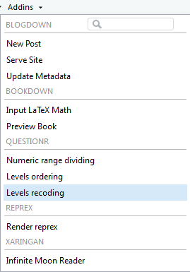
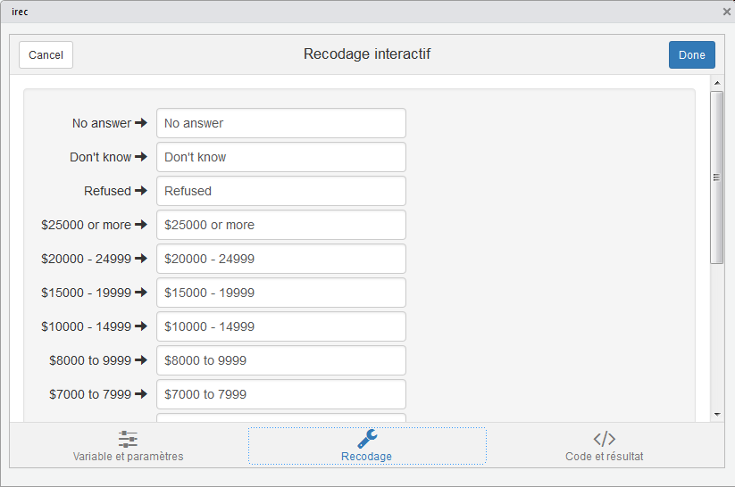

# Les variables {#variables}

## Introduction

Chacune des notions étudiées par le chercheur porte le nom de variable. C’est logique, puisque les données recueillies vont varier d’une unité statistique à une autre. On distingue quatre types de variables séparées en deux grandes catégories : les variables qualitatives et les variables quantitatives.

### Mise en place

Dans ce chapitre, nous introduirons les différents types de variables et les façons avec lesquelles nous pouvons les utiliser en langage `R`. Nous utiliserons la librairie `tidyverse` et en particulier l'extension `forcats` pour travailler avec des variables qualitatives. Puisque l'extension `forcats` fait partie du `tidyverse` de base, nous avons simplement à charger `tidyverse`.

```{r message=FALSE}
library(tidyverse)
```

## Les variables qualitatives {#qual}

Une variable qualitative est une variable dont les résultats possibles sont des **mots**. Les différents **mots** que peuvent prendre une telle variable sont appelées des **modalités**. Il existe deux types de variables qualitatives.

### Les variables qualitatives à échelle nominale {#qualinominale}

On observe ce type de variable lorsqu’il n’y a pas d’ordre croissant naturel dans les **modalités** de la variable. Par exemple, la variable _couleur des cheveux_ est à échelle nominale. L'ordre "blonds, bruns, roux, noirs, autre" est un ordre aussi valable que 
"bruns, noirs, roux, blonds, autre".

Imaginons que vous vouliez créer une variable qui indique le mois de l'année:

```{r}
x1 <- c("Déc", "Avr", "Jan", "Mar")
```

L'approche précédente pose deux problèmes:

1. Il n'y a que douze mois possibles et rien ne vous empêche de vous tromper dans votre entrée de modalités:

   ```{r}
   x2 <- c("Déc", "Avr", "Jam", "Mar")
   ```
   
1. Les modalités ne seront pas affichées dans un ordre logique

   ```{r}
   # La commande "sort" permet de trier les données
   sort(x1)
   ```
   
Nous pouvons résoudre ce problèmes en utilisant un **facteur** (**factor** en `R`). Pour créer un facteur, vous devez créer en premier lieu une liste avec __toutes les modalités possibles placées dans l'ordre qui vous convient__ (**levels** en `R`):

```{r}
niveaux_mois <- c(
  "Jan", "Fév", "Mar", "Avr", "Mai", "Jun",
  "Jui", "Aoû", "Sep", "Oct", "Nov", "Déc"
)
```

Vous pouvez maintenant créer un facteur:

```{r}
y1 <- factor(x1, levels = niveaux_mois)
y1
sort(y1)
```

Si certaines modalités ne sont pas dans votre liste de levels, elles seront converties en NA:

```{r}
y2 <- factor(x2, levels = niveaux_mois)
y2
```

Si vous n'utilisez pas vos levels, vos modalités seront affichées en ordre alphabétique:

```{r}
factor(x1)
```

Le fait qu'il y ait un __ordre__ dans les modalités n'est pas suffisant pour dire qu’une variable qualitative n'est pas nominale. Dans l'exemple précédent, bien que les mois de l'année soient toujours énumérés dans un certain ordre, il serait faux de dire que Janvier < Février par exemple.

Nous pourrions créer une variable qui contient la couleur des cheveux sans indiquer de levels. De cette façon, les données seront triées en ordre alphabétique:

```{r}
x3  <- c("blonds", "bruns", "roux", "noirs", "autre")
sort(x3)
```

Nous allons maintenant utiliser de vraies données provenant du [General Social Survey](http://gss.norc.org), qui est un sondage produit par une organisation de recherche indépendante NORC à l'Université de Chicago. Le sondage original comporte des milliers de questions, la base de donnéee `forcats::gss_cat` n'en contient que quelques unes.

```{r}
gss_cat
```

Pour visualiser les levels d'une variable facilement, nous pouvons utiliser la fonction `levels` qui retourne tous les levels différents rencontrés pour cette variable. Voici par exemple les levels pour les variables `race` et `marital`

```{r}
levels(gss_cat$race)
levels(gss_cat$marital)
```

### Les variables qualitatives à échelle ordinale {#qualord}

On observe ce type de variable lorsqu’il existe un ordre croissant dans les modalités de la variable. Par exemple, la variable _degré de satisfaction_ est à échelle ordinale. Il est possible de classer les modalités en ordre décroissant en écrivant : Très satisfait  >  Satisfait  >  Insatisfait  >  Très insatisfait.

Pour créer une variable qualitative à échelle ordinale en `R`, nous pouvons utiliser la même technique vue à la section \@ref(qualinominale). Nous pouvons donc avoir:

```{r}
z <- c("Satisfait", "Très insatisfait", "Insatisfait", "Très insatisfait", "Insatisfait")
niveaux_satisfaction <- c("Très insatisfait", "Insatisfait", "Satisfait", "Très satisfait")
z1 <- factor(z, levels = niveaux_satisfaction)
sort(z1)
```

Il est aussi possible d'utiliser des **facteurs ordonnés**. Nous devons utiliser encore la commande `factor` en ajoutant l'option `ordered=TRUE`. Par example:

```{r}
z2 <- factor(z, levels = niveaux_satisfaction, ordered = TRUE)
sort(z2)
```

Remarquons que dans la liste __Levels__, `R` ajoute les symboles `<` pour indiquer que la variable possède un ordre. Il n'est pas nécessaire de travailler avec des facteurs ordonnés.

Nous remarquons que dans la base de données `forcats::gss_cat`, la variable `rincome` représente une variable qualitative à échelle ordinale:

```{r}
levels(gss_cat$rincome)
```

Si nous laissons de côté les modalités _No answer_, _Don't know_ et _Refused_, le reste des modalités peut être placé en ordre. En effet, la modalité _$4000 to 4999_ est plus petite que la modalité _$5000 to 5999_ et ainsi de suite. 

> Bien que les modalités de la variable précédente soient composées de nombres, le fait que nous ayons affaire à des intervalles indique que nous avons en fait une variable qualitative à échelle ordinale.

Les modalités sont placées en ordre décroissant, si nous voulions avoir les modalités en ordre croissant, nous pourrions faire ceci:

```{r}
a <- factor(gss_cat$rincome, 
            levels=c("Lt $1000", "$1000 to 2999", "$3000 to 3999", "$4000 to 4999", 
                     "$5000 to 5999", "$6000 to 6999", "$7000 to 7999", "$8000 to 9999", 
                     "$10000 - 14999", "$15000 - 19999", "$20000 - 24999", "$25000 or more", 
                     "No answer", "Refused", "Not applicable", "Don't know"))
levels(a)
```

## Les variables quantitatives {#quant}

Une variable quantitative est une variable dont les résultats possibles sont des **nombres**. Les différents nombres que peuvent prendre une telle variable sont appelées des **valeurs**.

### Mise en place

Dans cette section, nous utiliserons la librairie `nycflights13` qui contient cinq bases de données portant sur tous les vols aériens ayant quittés la ville de New-York en 2013.

```{r message=FALSE}
library(nycflights13)
```

Les cinq base de données sont les suivantes:

- `airlines`
- `airports`
- `flights`
- `planes`
- `weather`

Pour en savoir plus sur une base de données particulière, par exemple `airlines` vous pouvez utilisez la commande `?airlines`.

### Les variables quantitatives discrètes

On observe ce type de variable lorsque les valeurs sont énumérables, c’est-à-dire lorsqu’il n’existe pas de valeur possible entre deux valeurs consécutives. Par exemple, la variable _nombre de cours suivis pendant cette session_ est une variable quantitative discrète. Les valeurs de ces variables peuvent être : 3, 4, 5, 6, 7,... Il est impossible de suivre 4,6 cours durant une session.

La base de données `planes` contient certaines variables quantitatives discrètes.

```{r}
planes
```

Pour être en mesure de connaître toutes les _valeurs_ différentes que peut prendre une variable, nous allons utiliser la commande `unique`. Si nous nous intéressons à la variable `engines` (qui dénombre le nombre de moteurs de l'avion):

```{r}
unique(planes$engines)
```

Les avions  peuvent donc avoir 1, 2, 3 ou 4 moteurs.

La variable `seats` (qui dénombre le nombre de sièges de l'avion):

```{r}
unique(planes$seats)
```

Dans la sortie `R` les valeurs ne sont pas en ordre croissant mais elles le seront lorsque nous les représenterons sous forme de tableau ou de graphique.

> Bien que la variable `seats` possède plusieurs valeurs (elle en possède `r length(unique(planes$seats))`), cela ne signifie pas qu'elle soit une variable quantitative continue, comme nous le verrons à la section \@ref(quantcont).

### Les variables quantitatives continues {#quantcont}

On observe ce type de variable lorsqu’il existe une infinité de valeurs entre deux autres. Par exemple, la variable _masse d’un étudiant (en lbs)_ est une variable quantitative continue. Entre 130 et 131 lbs, il existe une infinité de valeurs telles que 130,54 lbs.

Dans la base de données `weather` de l'extension `nycflights13`, nous allons observer la variable `temp`, qui représente la température en degrés Farenheit pour toutes les heures de chaques jours de l'année 2013.

```{r}
weather
```

Si nous utilisons la commande `unique` sur cette variable, nous obtenons la sortie suivante:

```{r}
unique(weather$temp)
```

Puisque nous avons `r length(unique(weather$temp))` températures différentes et que nous avons affaire à une variable quantitative continue, il est souvent avantageux de placer ces données dans des classes. Pour ce faire, nous devons utiliser la commande `cut` qui permet d'indiquer les frontières de ces classes. Voici un exemple où nous créons des classes de largeur 25:

```{r}
temp_classes <- cut(weather$temp,
                    breaks = c(0, 25, 50, 75, 100, 125),
                    include.lowest = TRUE,
                    right = FALSE)
unique(temp_classes)
```

Nous nous retrouvons donc avec `r length(unique(temp_classes))` classes. Lorsque nous présenterons les variables sous forme de tableau, il nous sera utile d'utiliser la commande `cut`.

L'option `include.lowest` indique que nous voulons conserver ...
L'option `right = FALSE` indique que nous voulons des intervalles fermés à gauche et  ouverts à droite.

## L'extension `questionr`

L'extension `questionr` propose une interface graphique pour faciliter l'opération qui consiste à réordonner vos données.

### Mise en place

```{r message=FALSE}
library(questionr)
```

```{r echo=FALSE}
data(hdv2003)
hdv2003 <- as.tibble(hdv2003)
```

### L'interface graphique

L’objectif est de permettre à l’utilisateur de saisir les nouvelles valeurs dans un formulaire, et de générer ensuite le code `R` correspondant au recodage indiqué.

Pour utiliser cette interface, sous RStudio vous pouvez aller dans le menu _Addins_ (présent dans la barre d’outils principale) puis choisir _Levels recoding_.

```{r addin-irec, echo = FALSE, out.width = "25%", fig.cap = "Levels recoding dans le menu Addins"}

```

Si nous utilisons l'interface graphique pour la variable `rincome` de la base de données `gts_cat`, nous obtenons:

```{r irec, echo = FALSE, out.width = "100%", fig.cap = "L'interface graphique de Levels recoding"}

```

L’interface se compose de trois onglets : l’onglet _Variable et paramètres_ vous permet de sélectionner la variable à recoder, le nom de la nouvelle variable et d’autres paramètres, l’onglet _Recodages_ vous permet de saisir les nouvelles valeurs des modalités, et l’onglet _Code et résultat_ affiche le code `R` correspondant ainsi qu’un tableau permettant de vérifier les résultats.

Une fois votre recodage terminé, cliquez sur le bouton _Done_ et le code `R` sera inséré dans votre script `R` ou affiché dans la console.

> *Important*: cette interface est prévue pour ne pas modifier vos données. C’est donc à vous d’exécuter le code généré pour que le recodage soit réellement effectif.